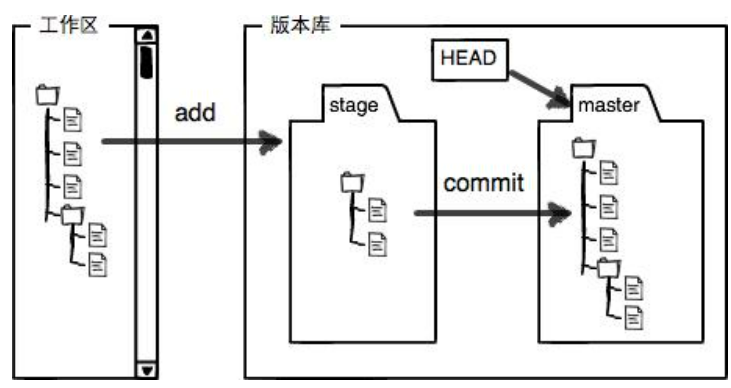

#Git


>**查看 ssh 公钥方法**：
打开你的 git bash 窗口
进入 .ssh 目录：cd ~/.ssh
找到 id_rsa.pub 文件：ls
查看公钥：cat id_rsa.pub 或者 vim id_rsa.pub

>**生成密钥**
git输入ssh-keygen -t rsa命令，指定RSA算法生成密钥，然后敲三次回车键，期间不需要输入密码，之后就就会生成两个文件，分别为>id_rsa和id_rsa.pub，即密钥id_rsa和公钥id_rsa.pub. 对于这两个文件，其都为隐藏文件，默认生成在以下目录：
Linux 系统：~/.ssh
Mac 系统：~/.ssh
Windows 系统：C:\Documents and Settings\username\.ssh
Windows 10 ThinkPad：C:\Users\think.ssh
```
git add .
git commit -m "wrote a readme file"
git push origin main
```
##创建版本库

1. 新建目录，通过git init命令把这个目录变成Git可以管理的仓库
2. 在该目录或子目录下新建文件
3. 添加到仓库，把文件修改添加到暂存区git add readme.txt
4. 提交到仓库，暂存区的所有内容提交到当前分支git commit -m "wrote a readme file"
*HEAD指向的版本就是当前版本 上一个版本就是HEAD\^，上上一个版本就是HEAD\^^，上100个版本写成HEAD~100*

##远程库
###远程库关联
1. 要关联一个远程库，使用命令git remote add origin git@server-name:path/repo-name.git；
2. 关联一个远程库时必须给远程库指定一个名字，origin是默认习惯命名；
3. 关联后，使用命令git push -u origin main第一次推送main分支的所有内容；
4. 此后，每次本地提交后，可以使用命令git push origin main推送最新修改

###远程库克隆
git clone git@github.com:Ava-yjt/learnSkills.git

##版本回退
场景1：还未推送到远程库</u>
git reset --hard HEAD^或git reset --hard 版本号[^1]

场景2：已经提交，想将远程指定分支拉取到本地当前分支上：
git pull origin <远程分支名>
[^1]:输入前几位即可


##撤销修改
Git checkout -- file让这个文件回到最近一次git commit或git add时的状态，可以恢复误删的文件
用命令git reset HEAD <file>可以把暂存区的修改撤销掉放回工作区

*场景1：没有add，向丢弃工作区的修改时，用命令git checkout -- file。
场景2：add到了暂存区时，想丢弃修改，第一步用命令git reset HEAD <file>，回到场景1，第二步按场景1操作。
场景3：已经commit到版本库但还没有推送，想撤销本次提交，参考版本回退。*

##分支管理

- 查看分支：git branch
- 创建分支：git branch \<name>
- 删除分支：git branch -d \<name>
- 切换分支：git checkout \<name>或者git switch \<name>
- 创建+切换分支：git checkout -b \<name>或者git switch -c \<name>
- 合并某分支到当前分支：git merge \<name>


##多人协作
1. 查看远程库信息，使用git remote -v；本地新建的分支如果不推送到远程，对其他人就是不可见的；
2. 在本地创建和远程分支对应的分支，使用git checkout -b branch-name origin/branch-name，本地和远程分支的名称最好一致；
3. 从本地推送分支，使用git push origin branch-name，如果推送失败，先用git pull抓取远程的新提交；
4. 如果有冲突，要先本地处理冲突再重新提交
5. git pull失败说明未关联，先建立本地分支和远程分支的关联，使用git branch --set-upstream-to branch-name origin/branch-name；


##常用命令
```git
git status	查看工作区的状态	
git diff	查看工作区和版本库里面最新版本的区别	
git log	历史提交版本记录	--pretty=oneline
git reflog	历史命令	
git rm	删除版本库中的文件	
git remote -v	查看远程库信息	
git remote rm	删除远程库（断开关联）	
git branch	查看当前分支,当前分支前面会标一个*号	
git branch <name>	创建分支	
git log --graph 看分支合并图。
```

###密钥SSH
[windows下GitHub的SSH key配置](https://www.jianshu.com/p/9317a927e844)
[Github配置ssh key的步骤](https://blog.csdn.net/weixin_42310154/article/details/118340458)
		
 参考[Git教程](https://www.liaoxuefeng.com/wiki/896043488029600)
		
		
		
		

		
		
		
