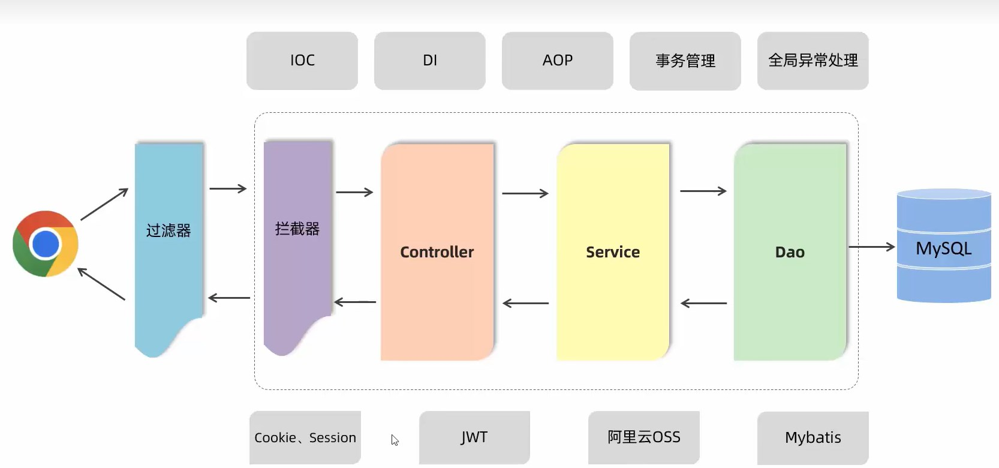
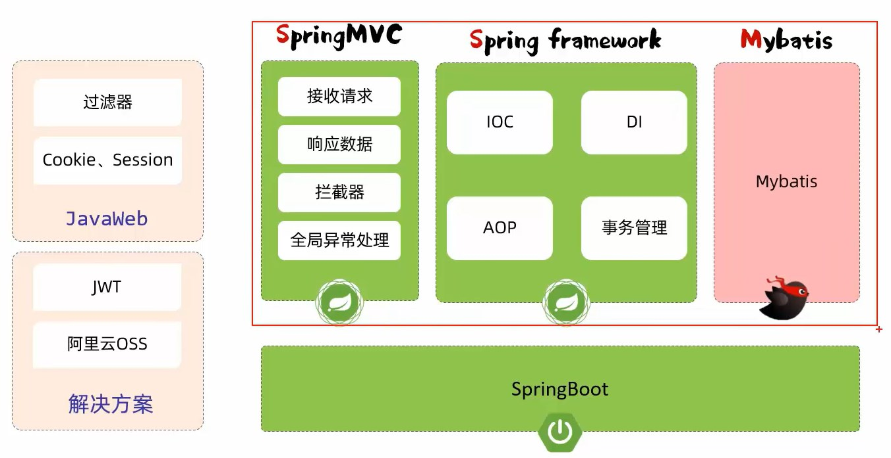
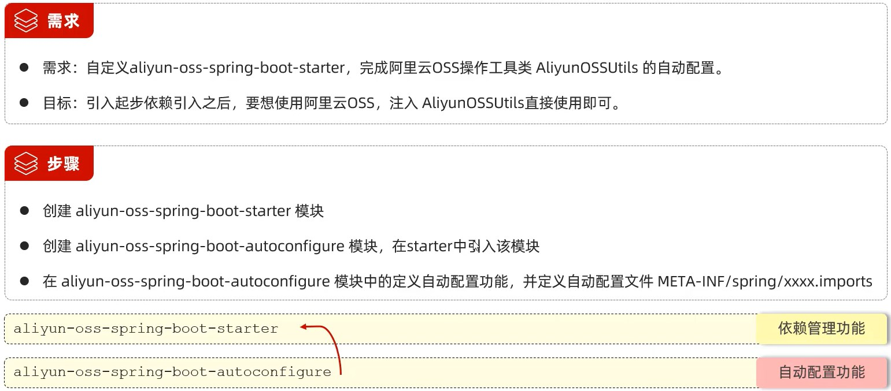

[Spring Boot+Spring mvc+Mybatis的基础框架](https://blog.csdn.net/sinat_27933301/article/details/88563560)
###软件准备
1. eclipse
2. node（view）
https://juejin.cn/post/7135687603419873317
3. tomcat(idea内嵌)
4. 依赖：web mybatis Mysql驱动 lombok
5. postman接口测试

##数据库表结构设计

ER图和关系模型是常用的数据库设计工具，ER图可以通过图形化的方式表示实体、属性和它们之间的关系，而关系模型则是通过关系表的方式来表示数据。

将ER图转换为关系模型需要遵循一定的规则，通常有以下步骤：

- 确定实体和实体属性 首先需要识别ER图中的实体，每个实体应该被转换成一个关系表。实体属性应该成为该表的列。
- 识别关系 在ER图中，关系是指实体之间的关系，例如一对多、多对多等。每个关系都应该被转换成一个关系表。如果关系包含属性，则应该添加相应的列。
- 确定主键 每个关系表都需要一个主键，用于唯一标识每个记录。通常情况下，主键可以是单个列或多个列的组合。主键不能为null，也不能重复。
- 确定外键 如果一个关系表依赖于另一个关系表，那么它必须包含另一个表的主键作为外键。外键建立了两个表之间的连接。
- 规范化 规范化是指将关系模型设计为最小化重复和数据冗余的过程。它包括分解表和创建新表以消除冗余数据。


##springboot
核心技术

后端框架

###自动配置原理
@ComponentScan("")   组件扫描  指明第三方bean、依赖的扫描范围
@Import()  导入普通类，配置类，ImportSelector接口是实现类
**@EnableXxxx封装@Import注解**
@Conditional 按一定条件判断是否注册bean到IOC容器中


###依赖管理
pom.xml声明依赖
每个依赖节点\<dependency>都由三个子节点组成：

\<groupId> ： 该依赖库所属的组织名称
\<artifactId> ： 依赖的库名
\<version> ： 依赖的库版本
在POM 4中，\<dependency> 中还引入了\<scope> ，它主要管理依赖的部署。目前\<scope> 可以使用5个值：

compile，缺省值，适用于所有阶段，会随着项目一起发布。
provided，类似compile，期望JDK、容器或使用者会提供这个依赖。如servlet.jar。
runtime，只在运行时使用，如JDBC驱动，适用运行和测试阶段。
test，只在测试时使用，用于编译和运行测试代码。不会随项目发布。
system，类似provided，需要显式提供包含依赖的jar，Maven不会在Repository中查找它。
运行mvn compile或者mvn package，Maven会自动下载相关依赖。

- spring-boot-starter-web包：会引入Spring基础包和Spring MVC包，此外它还会引入内嵌的Tomcat，所以我们不需要下载Tomcat就能运行工程。
- spring-boot-starter-test包：会引入测试相关的包。
- spring-boot-maven-plugin包：允许我们使用java -jar命令运行Spring Boot工程

####yml文件配置参数
例如数据库信息等
统一管理参数配置
通过@Value注入单个属性，
@ConfigurationProperties(prefix="")批量注入

####优先级顺序
命令行参数  --xxx=xxx(--server.port=9090)
java系统属性 -Dxxx=xxx
application.properties
yml
yaml

###插件
1. 分页插件PageHelper
依赖pagehelper-spring-boot-starter

###分层解耦
IOC容器 DI注入
[IOC-DI（分层解耦）](https://blog.csdn.net/y_k_j_c/article/details/130237155)
####bean
@Component  将当前类加入IOC容器池 默认在springboot启动时初始化
@Component 注解作用于类，而@Bean 注解作用于方法
衍生注解 @Controller @Service @Repository
第三方注解  @Bean
```
//声明一个配置类
@Configuration
public class CommonConfig{
    @Bean //将当前方法的返回值交给IOC容器管理
    public XXX Xxx(){
        return new Xxx();  
    }
}
```
@Autowired 依赖注入bean
private 
@Scope("prototype") 每次使用该Bean都会创建一个新实例
@Lazy  延迟初始化，第一次使用时才初始化

####实体类注解：
@Data
@NoArgsConstructor
@AllArgsConstructorxinzhongdekewang 

####web三层架构注解
controller（@RestController）  service(@Service)  mapper（接口、实现类 @Mapper） 

**controller传参**
@RequestParam(defaultvalue = '')
@RequestBody(json自动封装为JAVA实体)
@PathVariable（路径参数）

###自定义starter


###mybatis
基础操作
XML映射文件

###全局异常处理
@RestControllerAdvice
@ExceptionHandler(Exception.class)

###事务管理
@Transactional(rollbackFor = Exception.class)
propagation是否重开一个事务

###AOP 面向切面编程 
记录操作日志 权限控制 事务管理
注解 @Aspect
依赖 spring-boot-starter-aop
连接点 ProceedingJoinPoint
通知类型：@Around @Before @After @AfterReturning @AfterThrowing
通知顺序 @Order(1) 数字小的切面类先执行
切入点表达式 execution @annotation
连接点 JoinPoint 可获取目标运行时的相关信息（方法名、参数
返回值等）
```JAVA
@Retention(RetentionPolicy.RUNTIME)
@Target(ElementType.METHOD)
创建接口MyLog
```

```java
    @Pointcut("@annotation(com.itlearn.tlias.aop.MyLog)") //在需要的方法上注释
    @MyLog
    //@Pointcut("execution(* com.itlearn.tlias.service.*.*(..))") //通配符*  .任意一个参数 ..任意参数/层级 
    private void pt(){}  //public可被外部切面类引用

    @Around("pt()")  //切入点表达式
    public Object recordTime(ProceedingJoinPoint joinPoint) throws Throwable {
        long begin = System.currentTimeMillis();

        Object result = joinPoint.proceed();
        long end = System.currentTimeMillis();
        log.info(joinPoint.getSignature()+"方法执行耗时：{}ms", end-begin);

        return result;
    }

    @Before("execution(* com.itlearn.tlias.service.impl.DeptServiceImpl.*(..))")
```
###会话跟踪：JWT令牌


###打包
**[vue环境配置](https://github.com/dawpf/vue-config)**
idea默认启动的是是默认启动Tomcat的端口是8080
vue.config.js设置前端默认9528 // dev port
Vue的develop模式设置 VUE_APP_URL='http://localhost:8080/' 将后端设为8080

##WEB工程
###maven
https://mvnrepository

1. 安装 系统属性配置MAVEN_HOME和PATH
2. 修改conf setting.xml配置本地仓库E:\maven\repository
镜像仓库
```
	<mirror>
		<id>alimaven</id>
		<mirrorOf>central</mirrorOf>
		<name>aliyun maven</name>
		<url>http://maven.aliyun.com/nexus/content/repositories/central/</url>
	</mirror>
```

1. IDEA配置maven:安装3.6.1 maven
idea在settings配置Maven 修改maven版本和路径

1. dependencies  安装依赖
build plugins 生成插件

pom.xml
报错为：不再支持源选项5.请使用6/7 或 更高版本的，
是因为默认为JDK1.3或1.4，而你的电脑JDK高于1.3
在src同层目录的  pom.xml中加入：
```
<properties>
<project.build.sourceEncoding>UTF-8</project.build.sourceEncoding>
<maven.compiler.source>18</maven.compiler.source>
<maven.compiler.target>18</maven.compiler.target>
</properties>
```

###插件创建工程
指定项目目录下输入指令
java工程
mvn archetype:generate -DgroupId=com.itheima -DartifactId=java-project -
DarchetypeArtifactId=maven-archetype-quickstart -Dversion=0.0.1-snapshot -
DinteractiveMode=false
web工程
mvn archetype:generate -DgroupId=com.itheima -DartifactId=web-project -
DarchetypeArtifactId=maven-archetype-webapp -Dversion=0.0.1-snapshot -
DinteractiveMode=false

###创建简单WEB页面
https://juejin.cn/post/6997962146902442020#heading-3
https://blog.csdn.net/wpw2000/article/details/113450048
https://blog.csdn.net/TGFXK/article/details/124468807

###前端
[Node.js最新最详细安装教程（2020）](https://blog.csdn.net/Small_Yogurt/article/details/104968169)
###后端

[IDEA创建并运行简单web项目](https://blog.csdn.net/wpw2000/article/details/113450048)
[新建maven项目](https://blog.csdn.net/erlian1992/article/details/53942096)
[idea配置maven项目应用运行（Edit Configrations）](https://blog.csdn.net/danuo2011/article/details/104499351)

[web项目打成war包的三种方式](https://blog.csdn.net/cm15835106905/article/details/107927847?utm_medium=distribute.pc_relevant.none-task-blog-2~default~baidujs_baidulandingword~default-4-107927847-blog-122585695.235^v28^pc_relevant_default&spm=1001.2101.3001.4242.3&utm_relevant_index=7)
[Spring Boot+Spring mvc+Mybatis的基础框架demo](https://blog.csdn.net/sinat_27933301/article/details/88563560)

[日志框架之Logback的使用与详细配置](https://blog.csdn.net/qq_38628046/article/details/115050693)
