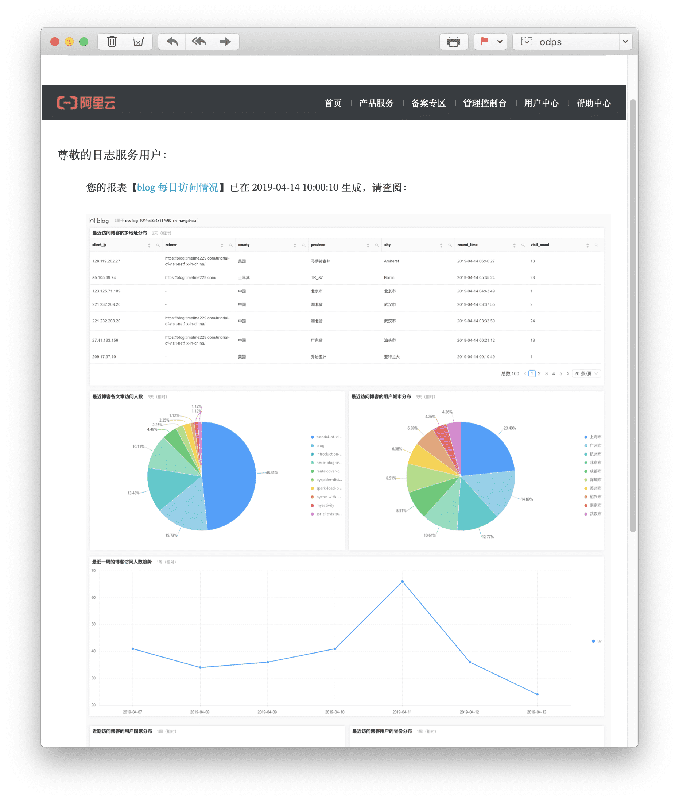
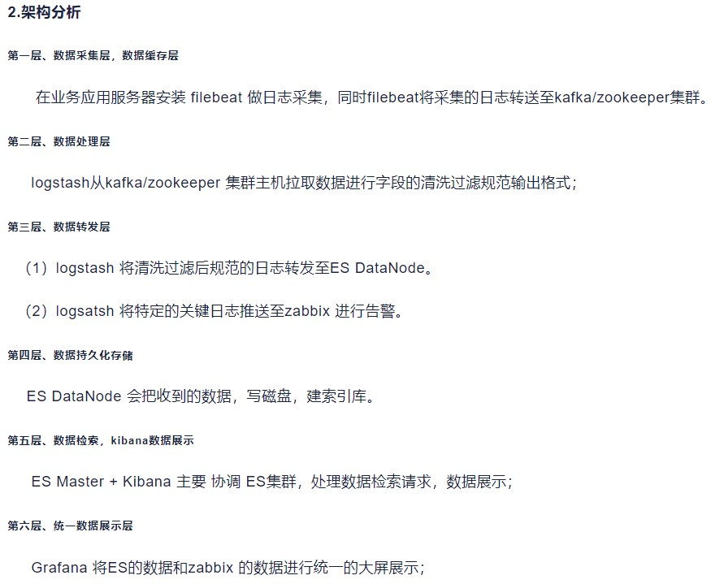

[监控分析平台对比](https://help.aliyun.com/zh/sls/product-overview/comparison-of-monitoring-and-analysis-platforms?spm=a2c4g.11186623.0.0.6b9062a8SpSzED)

1. 日志需求
   * 记录系统运行过程和详情，并进行存储,将系统执行的信息选择性的记录到指定的位置（控制台、文件、数据库）
   * 错误定位，问题排查：记录大部分的异常信息，如数据问题，网络问题，内存问题等，通过收集日志信息对系统的运行状态进行实时监控预警，让运维人员/开发人员在生产环境中能够快速准确定位到问题。需要快速检索，例如通过关键词过滤，秒级延时。
   * 监控、报警：实时处理（流式，小批量），秒级~分钟级延时。
   * 风控：实时流量处理，秒级延时。

2. 平台目标
   * 统一平台：为运维人员提供统一的日志信息平台，实时了解操作系统、网络设备、业务、数据库的运行情况。
   * 故障告警：实现对特定关键日志的告警推送，提升故障预警能力。（短信报警，邮件报警，电话报警（语⾳播报），通讯软件）
   * 日志检索分析：为开发和运维人员排查故障提供日志检索和统计功能，提高问题排查效率。
   * 实时服务：支撑日志的实时采集与消费，实现实时监控、风控。
   * 安全性：日志存储空间，保密性
  
3. 日志数据类型
   * Nginx日志：Nginx访问日志以及Nginx错误日志。
   * Java应用日志。
   * 错误日志: error、异常通知
   * 系统数据：应用本身所在虚拟机或ECS的资源情况。包括 CPU、Load、Memory、net、disk等通用硬件指标。
   * 网络设备日志：网路设备硬件告警信息、端口UP/Down等日志。
   * 埋点数据：应用中特定的流程收集一些信息，用来跟踪应用使用状况。
   * 服务调用链：各类Tracing数据。
   * 用户行为日志：登陆登出成功和失败的源主机和账户信息等。

[WEB系统服务端常见性能监控指标](https://developer.aliyun.com/article/675021)
[前端监控指标](https://developer.aliyun.com/article/1334089?spm=a2c6h.14164896.0.0.172747c5mOmUor&scm=20140722.S_community@@%E6%96%87%E7%AB%A0@@1334089._.ID_1334089-RL_WEB%20%E7%9B%91%E6%8E%A7%E6%8C%87%E6%A0%87-LOC_search~UND~community~UND~item-OR_ser-V_3-P0_11)
[Web应用防火墙日志服务常用的监控指标](https://www.alibabacloud.com/help/zh/web-application-firewall/latest/common-monitoring-metrics-v3)
 
4. 产品调研
* 日志：ELK（开源的Elasticsearch+Logstash+Kibana组合，不包含告警功能）、filebeat(轻量级)
* 监控：Prometheus（监控）+Grafana（可视化）、zabbix
* 链路追踪：Jaeger、Zipkin、SkyWalking
   Logging系统（ELK）可以处理监控和日志追踪的需求，但前两者的领域有更专业的工具，不推荐直接使用普通的日志聚合系统；Logging系统一般用来处理大型系统的日志聚合以及检索查询
  [监控、链路追踪、日志的区别](https://blog.csdn.net/youanyyou/article/details/114433703)
  [常用开源监控系统分析推荐](https://blog.csdn.net/wufaliang003/article/details/127470723?ops_request_misc=%257B%2522request%255Fid%2522%253A%2522169450278216800222871367%2522%252C%2522scm%2522%253A%252220140713.130102334.pc%255Fall.%2522%257D&request_id=169450278216800222871367&biz_id=0&utm_medium=distribute.pc_search_result.none-task-blog-2~all~first_rank_ecpm_v1~rank_v31_ecpm-5-127470723-null-null.142^v93^chatsearchT3_2&utm_term=%E5%90%8E%E7%AB%AF%20%E5%BC%80%E6%BA%90%E7%9B%91%E6%8E%A7%E7%B3%BB%E7%BB%9F&spm=1018.2226.3001.4187)
  [监控系统 Prometheus 的说明](https://blog.csdn.net/wu6cfp38/article/details/130078647)
  [java应用监控之调用链跟踪选型之Zipkin、Pinpoint、SkyWalking、CAT](https://cloud.tencent.com/developer/article/1431424)

5. 阿里云日志服务 loghub SLS
* 数据采集：Logtail采集接入、数据批量导入(FTP\OSS)、数据流式导入（LogHub）
* 日志存储：Logstore
* 结果分析可视化：自带Loghub Dashboard，也支持DataV、Grafana、Tableua等对接方式
* 告警监控：发送通知（例如短信通知）
* 链路追踪：可观测链路 OpenTelemetry 版，可接入下游日志服务

[日志服务支持的数据来源](https://help.aliyun.com/zh/sls/user-guide/data-collection-overview?spm=a2c4g.11186623.0.i59)

[采集企业内网服务器日志](https://help.aliyun.com/zh/sls/user-guide/how-do-i-collect-logs-from-servers-in-a-corporate-intranet?spm=a2c4g.11186623.0.i6)
[可观测链路 OpenTelemetry 版](https://www.alibabacloud.com/help/zh/tracing-analysis/latest/what-is-tracing-analysis)

1. ELK+Filebeat日志架构
   * 存储和搜索Elasticsearch
   * Filebeat采集日志
   * 搜集和过滤Logstash kafka
   * 分析与可视化Kibana 
架构分析：数据采集缓存、数据处理清洗、数据转发、数据持久化存储、数据检索、统一数据展示

[Kibana 可视化ElasticSearch数据展示分析](https://blog.csdn.net/weixin_38087443/article/details/102651312)
Zabbix server可以通过SNMP，zabbix agent，ping，端口监视等方法提供对远程服务器/网络状态的监视，数据收集等功能
为什么要使用es存储日志：es是一种搜索服务器，底层是基于Lucene，支持倒排索引，做搜索的效率是特别高的。基于业务需要还是可以考虑选择Mongdb、Redis、Mysql。

为什么elk要结合kafka
1.如果单纯的使用 elk 的话，服务器节点扩容 需要每个服务器上安装我们Logstash步骤比较冗余。
2.Logstash读取本地日志文件，可能会对本地的磁盘io性能会有一定影响。

使用成本相似，阿里云可以提供有限的技术支持，不提供搭建服务，接入有问题可以咨询。

# 技术学习
## spring Boot Actuator
Actuator使用Micrometer与这些外部应用程序监视系统集成，只需很少的配置即可轻松集成外部的监控系统。
Micrometer 为 Java 平台上的性能数据收集提供了一个通用的API，应用程序只需要使用 Micrometer 的通用 API 来收集性能指标即可。Micrometer会负责完成与不同监控系统的适配工作。这就使得切换监控系统变得很容易。

##日志框架搭建
[SpringBoot+Kafka+ELK集成日志采集可视化框架](https://blog.csdn.net/yy339452689/article/details/103296017?ops_request_misc=%257B%2522request%255Fid%2522%253A%2522169457388716800213067154%2522%252C%2522scm%2522%253A%252220140713.130102334.pc%255Fall.%2522%257D&request_id=169457388716800213067154&biz_id=0&utm_medium=distribute.pc_search_result.none-task-blog-2~all~first_rank_ecpm_v1~rank_v31_ecpm-4-103296017-null-null.142^v93^chatsearchT3_2&utm_term=web%E5%8F%AF%E8%A7%86%E5%8C%96%E6%97%A5%E5%BF%97%E6%A1%86%E6%9E%B6&spm=1018.2226.3001.4187)
[基于ELK系统的设备日志自动化抓取及可视化解决方案](https://blog.csdn.net/xxxxxxxxxxxaa/article/details/126582321?ops_request_misc=&request_id=&biz_id=102&utm_term=%E6%97%A5%E5%BF%97%E9%87%87%E9%9B%86%E5%8F%AF%E8%A7%86%E5%8C%96%E6%A1%86%E6%9E%B6&utm_medium=distribute.pc_search_result.none-task-blog-2~all~sobaiduweb~default-4-126582321.142^v93^chatsearchT3_2&spm=1018.2226.3001.4187)
[阿里云日志服务SLS学习笔记](https://zhuanlan.zhihu.com/p/111724137)

