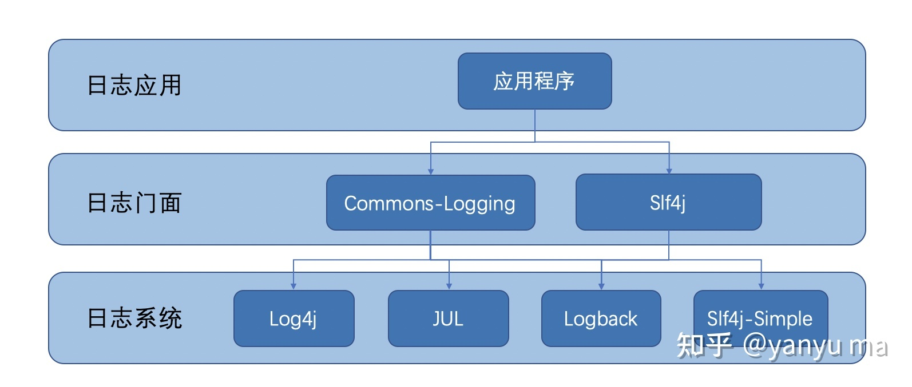

#技术选型

在开发软件过程中，一组工具链（toolchain）是一系列用于制作软件程序的工具。这些工具一般一个接一个地运用，上一个工具的输出即是下一个工具的输入，因此得名。但工具链这个词汇也可指涉这些工具并无此相依执行的限制。

通常一个软件开发的工具链由以下组成：
编译器
链接器（将源代码/目标代码转换成可执行程序档）
库（提供与操作系统之间的界面）
调试器（用来测试、调试所产出的程序）

##框架组件
[后端服务开发 - 认识后端框架](https://zhuanlan.zhihu.com/p/87927890)
https://blog.csdn.net/Listron/article/details/115293172
https://cloud.tencent.com/developer/article/1598087
spring mvc+mybatis更灵活
SSH(struts核心控制器+spring持久层java Bean对象管理池+hibernate数据库连接映射池)
Hibernate有自己的日志统计功能，而MyBatis需要使用Log4j实现。MyBatis缓存特性相对Hibernate更高。
* 数据层：mybatis，负责和数据库进行连接，负责SQL的处理，以及将查询到的数据映射成指定的java对象。
* API层：spring mvc，Struts（J2EE）负责根据不同的API请求来调用程序中不同的处理方法，负责将调用者传入的数据映射成java对象，也负责处理程序返回给客户端的响应数据格式等
* 业务层：spring，简化代码复杂度，控制反转和依赖注入
* 外加重要的：spring boot，进一步简化基于 spring 框架的项目的构建工具。
  
* 消息队列
基于日志设计的**Kafka**，重事务的RabbitMQ。对消息丢失不是特别敏感的话，选择Kafka可以获得更高的性能
[消息队列对比](https://learnku.com/articles/36282)
* 文件存储
Hadoop 的 HDFS 是目前最常用的分布式文件存储方案。除此之外，还有一个开源的轻量级分布式文件系统——**FastDFS**，可以解决大数据量存储和负载均衡等问题。特别适合以中小文件（建议范围：4KB < file_size <500MB）为载体的在线服务，如相册网站、视频网站等等。
[FastDFS(二)架构及原理](https://juejin.cn/post/7106139841527562254)
* 日志框架
Log4j+SLF4J ； LogBack。
* WEB服务器组件 Tomcat
* 服务器Tomcat（JAVA） Apache（支持所有语言） Nginx(python)
* 数据库Mysql 缓存Memcache 或者Mysql 和 Redis，前者用于保存业务数据，后者用于集中式缓存。[MySQL与Redis的区别与联系详解](https://zhuanlan.zhihu.com/p/141385393)
* 1MB以下小文件Hadoop
* 几百MB大文件，海量日志数据 Hadoop Hbase

##软件配置
JDK17-20
TOMCAT8-10
WEB服务器Apache（静态HTML）+ JAVA应用服务器Tomcat（动态JSV、Servlet）
IIS+ASP
https://blog.csdn.net/m0_45406092/article/details/114035427

##服务器
服务器可为工作站以及PC提供各种服务，包括网络通信服务、文件共享服务、硬件共享服务以及各种资源服务。
工作站在获取服务器各种资源的同时也可以帮服务器分流计算等任务。
服务器和工作站的申请要求一样高吗？只是用于备份的话，可否申请物理机工作站？申请流程

Web服务器和数据库服务器都是企业最常见的应用。应用程序要求CPU强，数据库服务器要求内存大
###Web服务器
其实web服务器是一个性能追求性服务器，对web服务器配置的要求主要取决于web的访问量，具体安装何种web应用，Apache或IIS，对服务器的硬件配置影响不大。以每秒200个用户并发访问量为例，推荐服务器HP DL 160 Gen9 1U机架式服务器，配置为：Intel Xeon E5-2609 V3*1，16G内存，3*600G 10K SAS硬盘，双端口1GB网卡，1+1冗余电源。
云服务器4核CPU/8G内存/8M公网带宽	APP、视频、购物类网站，ERP系统，大数据及实时在线或离线分析、深度学习、批量计算、视频编码等
Web服务器对硬件要求不高，甚至一般的硬件配置（2颗4核、8G内存、1T硬盘）即可满足需求，如果后期Web服务访问量上升，只需要新增同等配置的服务器加入负载均衡集群即可实现Web服务的性能扩展。
https://www.zhihu.com/question/26708830?utm_id=0

**常用的web服务器:**
Apache、IIS、Nginx、Tomcat等
[Apache 和 Tomcat ](https://www.zhihu.com/question/37155807)

[Centos上搭建Nginx方法详解](https://zhuanlan.zhihu.com/p/144143399)
Nginx:静态HTTP服务器,反向代理器，负载均衡，解决跨域的问题。比如我们向一台服务器的80端口发送了请求，该请求首先由Nginx监听到，其接受到请求内容后再转发给其他服务器，其他服务器处理完后再将结果传送给Nginx，最后由Nginx来统一返回给初始请求端。项目部署在不同的服务器上，但是通过统一的域名进入，nginx则对请求进行分发，减轻了服务器的压力。
可以将 Apache 前面的 Nginx 用作服务器代理。这利用了 Nginx 的快速处理速度和同时建立大量连接的能力。对于静态连接，Nginx 会将文件快速服务到客户端。对于动态内容，例如 Php 文件，Nginx 反向代理服务器会将他们的请求代理到 Apache，然后 Apache 可以处理其结果并返回其呈现的页面。

　　对于静态连接，Nginx 会将文件快速服务到客户端。对于动态内容，例如 Php 文件，Nginx 反向代理服务器会将他们的请求代理到 Apache，然后 Apache 可以处理其结果并返回其呈现的页面。

###应用服务器
承担了功能和计算实现。提供处理逻辑的应用容器，这里的应用很多，如果java应用、C#应用、ruby应用等。应用服务器提供访问商业逻辑的途径以供客户端应用程序使用。

比如Tomcat、Resin、WebLogic、Websphere、jboss等此类。配置的内存在16GB-32GB之间即可，大于32GB的内存配置基本是浪费了。

**常用的应用服务器:**
Tomcat、Jetty、Weblogic等

Web服务器和应用服务器的关系
WEB服务器一般是通用的，而应用服务器一般是专用的，如Tomcat只处理JAVA应用程序而不能处理ASPX或PHP。而Apache是一个WEB服务器（HTTP服务器），他的信息源可以是配置在tomcat中的JAVA应用，也可以是ASPX应用。

Web服务器只负责处理HTTP协议，只能发送静态页面的内容。而JSP，ASP，PHP等动态内容需要通过CGI、FastCGI、ISAPI等接口交给其他程序去处理。这个其他程序就是应用服务器。

###数据库服务器
数据库服务是数据读取写入密集型应用，对服务器的内存资源和磁盘性能要比较高，CPU要求其次，如果对数据库可用性要求级别比较高，推荐使用数据库集群方案。以普通ERP数据库为例，用户为200人，数据库大小约100G，推荐配置HP DL380 Gen9服务器，配置：Intel Xeon E5-2620 V3*1，32G内存，4*600G 10K SAS硬盘，标准千兆网卡，1+1冗余电源。

数据服务器对硬件要求最高，主要特征是CPU要足够快、内存足够大，磁盘IO足够快和稳定。比如：MySQL、Oracle服务器要求CPU配置一定要好，最好是双路志强金牌Gold，磁盘最好使用SSD系列。SSD硬盘属于固态硬盘，优点是读写速度快，缺点是价格昂贵。

而Redis服务器主要是内存型应用，所以要求内存一定要足够大，并且可扩展，而对磁盘和CPU要求就没那么高。

云服务器：担心安全性，
本地：无需网络，后期需要专人维护，可能出现硬件损坏数据丢失
https://zhuanlan.zhihu.com/p/139712574

##通用模块
###日志管理系统
1. 日志管理的作用
   - 记录系统运行过程和详情，并可以进行存储,将系统执行的信息选择性的记录到指定的位置（控制台、文件、数据库）
   - 开发调试：在开发调试阶段:日志系统有助于更快的定位问题，通过查看日志信息我们可以方便地知道当前程序的运行状态是否符合预期。
   - 错误定位：在应用运维阶段:日志系统有助于记录大部分的异常信息，如数据问题，网络问题，内存问题等，通过收集日志信息可以对系统的运行状态进行实时监控预警，让运维人员/开发人员在生产环境中能够快速准确定位到问题
   - 数据分析：完成对用户行为的收集，用户画像对于公司下一步的战略方向有一定指引作用。
2. 为什么要用日志框架，传统日志输出的局限性
   - 日志缺乏持久化手段。System.out和System.err等方式都是只能在控制台上输出，但实际部署项目的时候我们不可能一直盯着控制台的输出来观察是否有错误产生，所以这种缺乏持久化的日志输出方式是不符合我们实际的运维需求的。
   - 日志输出源、输出方式单一。上述方式只能满足我们简单的控制台输出，实际上我们还希望能对日志进行文件的持久化，数据库的保存或者是通过JMS进行推送等其他操作。
   - 日志信息缺少级别分层。没有根据信息的重要程度进行分级，不便于我们日后对日志进行分析。

3. 流行JAVA WEB日志框架
   对日志的输出需求基本就是可定义的日志级别、可定义的输出源、可定义的日志格式。
   日志实现（日志实现框架）：JUL（java util logging）、logback、log4j、log4j2
   日志门面（日志标准接口框架）：JCL（Jakarta Commons Logging）、slf4j（Simple Logging Facade for Java）

   

   日志级别：ALL < TRACE < DEBUG < INFO < WARN < ERROR < FATAL < OFF

1. 项目的需求是什么？如何选型，难度对比分析
     - Slf4j 与 Logback ：最流行，新项目建议，适配性好；需要slf4j-api、logback-api、logback-classic三个包

   - Slf4jF+log4j2

2. **实操，如何使用，用到的组件、规范、基本操作步骤**

   - [创建logback.xml配置文件](https://www.jianshu.com/p/4143c1ffbffd)
      命名为logback-spring.xml的日志配置文件，将xml放至 src/main/resource下面。
   也可以使用自定义的名称，比如logback-config.xml，只需要在application.properties文件中使用logging.config=classpath:logback-config.xml指定即可。

   - [在程序中引用Logback](https://blog.51cto.com/u_15246373/5017165)
   - userController添加log代码 logger.info("  ");
   - 与lombok集成：logback和lombok集成，使用@Slf4j注解标注类，可直接使用log对象，需添加lombok依赖
   >
       <dependency>
               <groupId>org.projectlombok</groupId>
               <artifactId>lombok</artifactId>
               <optional>true</optional>
           </dependency>
      报错：找不到符号slf4j，打印出的log在根目录下，没有info信息

   其他参考：
   [java日志案例实战Slf4j 与 Logback](https://developer.aliyun.com/article/1105296)
   [日志框架之Logback的使用与详细配置](https://blog.csdn.net/qq_38628046/article/details/115050693)
   [java 依赖](https://www.cnblogs.com/teach/p/15887258.html)
   [全网最全的 SpringBoot+Logback 日志配置教程](https://zhuanlan.zhihu.com/p/569088066)
   [日志基本格式要求](https://www.jianshu.com/p/cdc51dd6fa07)

引用
[Java日志框架详解](https://www.jianshu.com/p/4894760181c4)

3. 日志存储方式
   保存15天，文件形式存储
   日志是按照错误级别分级的，常见的错误级别有 FATAL / WARNING / NOTICE / DEBUG / TRACE 5 种类型。通常我们会在项目里面定义一个日志打印级别，高于这个级别的错误日志会数据落盘。

###监控管理
1. 希望实现什么功能
   - 报警\帮助排查问题\数据分析
   - 日志管理及下载 
   - 实时web查看日志
   - 日志分级，按一定格式和顺序存储
   - 运维人员可读懂
  
2. 怎么把logback用到监控系统中？
3. 调研
   [分布式日志系统的设计和实践](https://xie.infoq.cn/article/28312d7d2a31fc3e991446db5)
   [TB级微服务海量日志监控平台](https://cloud.tencent.com/developer/article/1893998?from=15425&areaSource=102001.2&traceId=jZgnXvdUHgnJjB-FhF7Ey)
   日志统一收集、过滤清洗。
   生成可视化界面、监控，告警，日志搜索。

   需要搭建日志收集客户端及服务端、日志查询的web服务、remote组件、router组件

   ELK:存储和分析所需要占用的机器成本较大，有必要对日志进行过滤

   **后端日志系统**
   logback自己搭建系统，可参考Git开源代码
   ELK 日志运维，需要学习配置、使用方法；架构比较清晰，易于扩展，稳定性好；可以定制展示内容，数据可视化做的好
   **前端日志系统**
   [CSI.JS前端日志系统](https://github.com/tnfe/csijs) 使用方便
   [ELK前端日志分析、监控系统](https://zhuanlan.zhihu.com/p/23985135)

4. 实操
   [Java监控本地日志并实现实时查看](https://zhuanlan.zhihu.com/p/442504826)
   ELK
   [ELK搭建（一）：实现分布式微服务日志监控](https://blog.csdn.net/qq_24950043/article/details/122291125)

5. 设计方案
   分级记录+过滤存储+告警提示+可检索+可视化+可定位
   在分布式大规模场景中需要建立集中式日志收集系统，将所有节点上的日志统一收集，管理，访问。但我们的业务比较单一，2-4个服务实例。

###在线编辑器
原理：把代码上传到服务器固定的文件里，然后让服务器的python编辑器运行代码，最后将结果返回。
jupyter
[在网页中嵌入Jupiter Notebook server](https://blog.csdn.net/weixin_46595988/article/details/120545542)
[Jupyter notebook转化为网页](https://blog.csdn.net/Sakura55/article/details/80849089?spm=1001.2101.3001.6650.16&utm_medium=distribute.pc_relevant.none-task-blog-2%7Edefault%7EBlogCommendFromBaidu%7ERate-16-80849089-blog-103720547.235%5Ev28%5Epc_relevant_default&depth_1-utm_source=distribute.pc_relevant.none-task-blog-2%7Edefault%7EBlogCommendFromBaidu%7ERate-16-80849089-blog-103720547.235%5Ev28%5Epc_relevant_default&utm_relevant_index=21)
[java编辑器集成jupyter](https://blog.csdn.net/IT837684734/article/details/124298929)
pyscript
https://blog.csdn.net/jinjiangongzuoshi/article/details/124833923
https://www.freecodecamp.org/chinese/news/pyscript-python-front-end-framework/

java运行python脚本
[JAVA调用Python的几种方法](https://www.cnblogs.com/wuwuyong/p/10600749.html)
[SpringBoot（Java）调用Python脚本及传参](https://blog.csdn.net/qq_37331119/article/details/127508383?spm=1001.2101.3001.6650.1&utm_medium=distribute.pc_relevant.none-task-blog-2%7Edefault%7ECTRLIST%7ERate-1-127508383-blog-109708115.235%5Ev28%5Epc_relevant_default&depth_1-utm_source=distribute.pc_relevant.none-task-blog-2%7Edefault%7ECTRLIST%7ERate-1-127508383-blog-109708115.235%5Ev28%5Epc_relevant_default&utm_relevant_index=2)
[SpringBoot 调用python接口](https://blog.csdn.net/weixin_43953722/article/details/121703173?utm_medium=distribute.pc_relevant.none-task-blog-2~default~baidujs_baidulandingword~default-1-121703173-blog-127508383.235^v28^pc_relevant_default&spm=1001.2101.3001.4242.2&utm_relevant_index=4)
[springboot调用python接口](https://blog.csdn.net/weixin_40502718/article/details/128484619?spm=1001.2101.3001.6650.5&utm_medium=distribute.pc_relevant.none-task-blog-2%7Edefault%7ECTRLIST%7ERate-5-128484619-blog-121703173.235%5Ev28%5Epc_relevant_default&depth_1-utm_source=distribute.pc_relevant.none-task-blog-2%7Edefault%7ECTRLIST%7ERate-5-128484619-blog-121703173.235%5Ev28%5Epc_relevant_default&utm_relevant_index=10)
[Java(springboot)调用python脚本（第三方库）](https://blog.csdn.net/weixin_42414127/article/details/111410644?spm=1001.2101.3001.6650.19&utm_medium=distribute.pc_relevant.none-task-blog-2%7Edefault%7EBlogCommendFromBaidu%7ERate-19-111410644-blog-118907588.235%5Ev28%5Epc_relevant_default&depth_1-utm_source=distribute.pc_relevant.none-task-blog-2%7Edefault%7EBlogCommendFromBaidu%7ERate-19-111410644-blog-118907588.235%5Ev28%5Epc_relevant_default&utm_relevant_index=19)
[Python代码一键转Jar包](https://cloud.tencent.com/developer/article/1743355)

###容灾
1. 为什么要容灾？
容灾系统主要是为了实现在主中心系统发生灾难时，可以在规定时间切换到备份中心，保证数据不会丢失，并且继续向用户提供服务。

除了数据级的灾备，还应提供系统级的灾备。即在将数据复制到云端的同时，也将受保护的应用程序的状态复制到云端，当灾难发生时可以立即切换到云端的应用程序运行，保证业务连续性。系统级灾备是通过操作系统虚拟化和检查点实现的。**检查点**用来捕获进程某一时刻的运行状态，从而实现进程迁移，恢复时能够复原到最近一次保留的数据映像。

2. 调研
   容灾通常是通过冗余方式来实现的。往往在灾难发生时，主要技术人员不能及时到达现场，为了顺利实现系统间的切换，应该让系统切换操作尽可能地简单; 并建立固定化的、标准化的切换流程。
   [灾备方案原则、技术](https://www.vinchin.com/blog/vinchin-technique-share-details.html?id=1502)
   基于IP的SAN远程数据容灾备份技术应用比较广泛，其是利用基于IP的SAN的互连协议，将主数据中心SAN中的信息通过现有的TCP/IP网络，远程复制到备份中心的SAN中的。当备份中心存储的数据量过大时，可利用快照技术将其备份到磁带库或光盘库。

3. 本项目容灾的重点
   模型和训练数据、用户信息等需定时更新备份
   应用程序本身、静态资源（主页展示图片、产品介绍，存储在阿里云可容灾）等基本不做修改
   应用服务器和数据库服务器的备份，尽量实现程序运行中间状态的保存。
4. 容灾方案设计

   备份+切换+运行
   **备份：**
   能否对数据加密保存？利用公有云端备份
   应用由阿里云端或由单机通过网络备份i2Cloud
   数据由数据湖备份
      0级容灾：备份主要针对人为误操作、病毒感染、逻辑错误等因素，用于业务系统的数据恢复，数据备份一般是在同一数据中心进行。
   **切换：**
   [通过虚拟IP实现服务器容灾的自动切换](https://blog.51cto.com/hujiangtao/1944292)
   定时发送免费ARP可以防止VRRP虚拟IP地址冲突
   当网络中存在VRRP备份组时，需要由VRRP备份组的Master路由器周期性的向网络内的主机发送免费ARP报文，使主机更新本地ARP地址表，确保网络中不会存在与VRRP虚拟IP地址相同的设备。用户可以设定VRRP虚拟IP地址和MAC地址对应关系。

   
##备注
算子开发
算子代码实现：算子计算逻辑及调度的实现。
算子原型定义规定了在昇腾AI处理器上可运行算子的约束，主要体现算子的数学含义，包含定义算子输入、输出、属性和取值范围，基本参数的校验和shape的推导
算子工程编译部署：编译自定义算子工程，生成自定义算子安装包并进行自定义算子包的安装，将自定义算子部署到算子库（OPP）。
算子测试：将自定义算子加载到网络模型中进行运行验证。

展示层：
负责用户界面设计，如登录页面、开发页面等
业务层：
负责业务逻辑处理，如数据管理、模型运行等
数据层：
负责完成数据访问，如增删改查 ，日志记录等
存储层：
负责数据的存储，如MySQL、缓存Memcache等

出离心
禅定
人在一切顺利的时候失去了对苦的敏感
占有喜欢的东西，远离讨厌的东西都是我们的欲望。
缘起：爱，取，有
我执
只要我们有贪求的对象，“我”就会牢不可破。